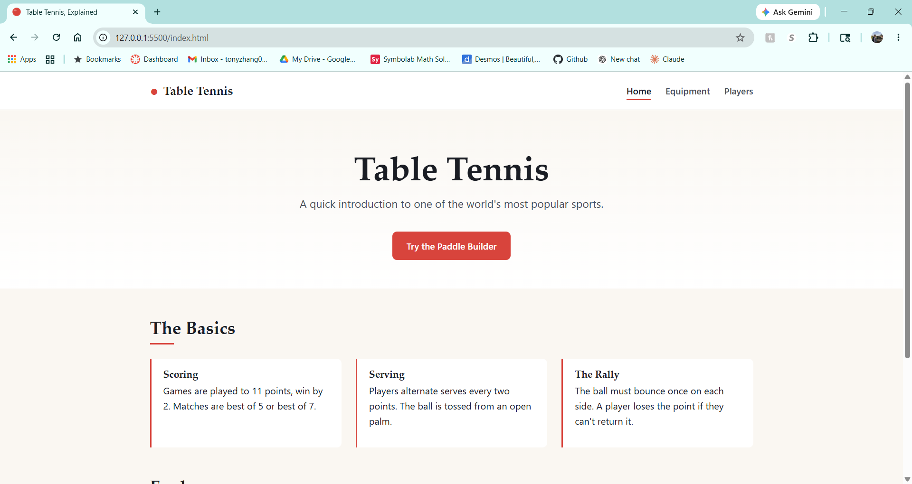

# Table Tennis, Explained

An informational homepage about table tennis: rules, equipment, top players, and an interactive Paddle Builder.

## Author

Tony Zhang

## Class

CS5610 Web Development

## Project Objective

A static front-end site built with vanilla HTML5, CSS3, and ES6+ JavaScript. Three pages introduce table tennis to newcomers: a homepage with the basics, an equipment page with an interactive Paddle Builder, and a players page with short profiles and a brief history.

## Screenshot

## Build & Run

No build step required. The site is a static front-end project.

To run locally, open the project in VS Code and use the Live Server extension: right-click `index.html` and select "Open with Live Server."

The site is deployed on GitHub Pages at [your deployed URL].

## Use of GenAI

- **Tool:** Claude (Anthropic), Claude Opus 4.7
- **Date:** May 2026
- **Used for:** helping generate descriptions, writing the `players.html` page, and helping with Paddle Builder logic.
- **Prompts:** "help generate the different combinations of blades and rubbers for the Paddle Builder"; "write the players page content"; "fix up the paddle descriptions."; "how can I display the different paddle combinations to the user"

## License

MIT — see [LICENSE](LICENSE).